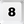
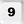
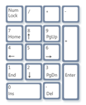

#Windows Alignment within EDE 

***EDE*** offers a broad functionality ***to align your active window on the current monitor***. The alignment functionality is 
highly configurable and can be for example configured to mimic the Windows Aero-Snap functionality of using keys *WIN*+*LEFT* and *WIN*-*RIGHT* to move the window 
around the monitor (but: EDE-Windows alignment only moves around the current monitor).

Windows alignment comprises positioning as well as resizing the window.

As it's a quite complex feature, the general concept is described first.

## General Concept

- The windows aligment in ***EDE*** is accessible on TAB1 (Opened via  + ) and subsequently pressing one of the NUMPAD-Keys , , , , , , , , .

- The NUMPAD-Keys above could be considered as a compass. This could be used as a crib to memorize the aligment directions.

  <->  <-> 
  
Direction-Key                   | Direction  | Description
--------------------------------|------------|---------------------------------------
 | South-West | Moves Window to the lower left corner of the current screen
 | South      | Moves Window to the lower border of the current screen
 | South-East | Moves Window to the lower right corner of the current screen
 | West       | Moves Window to the left border of the current screen
 | Center     | Moves Window to the center of the current screen
 | East       | Moves Window to the right border of the current screen
 | North-West | Moves Window to the upper left corner of the current screen
 | North      | Moves Window to the upper border of the current screen
 | North-East | Moves Window to the upper right corner of the current screen

- For each direction key several destination positions/sizes can be configured ("Position configurations)). 

- While TAB1 is active the direction-keys can be pressed repeatedly (either the same or a different direction key). This moves/resizes the current window on the current screen according to the associated position configuration. For example pressing direction-keys - (while TAB1 is active) moves/resizes the window to the position/size defined in the second position configuration for this direction key. 

- Each direction key may have an endless number of position configurations - repeatedly pressing the direction key (while TAB1 is active) cycles through the direction keys position configurations (if the last position configuration is used the next movement will go to the first position configuration). 

- For documentation on configuration see [Configuration file](https://github.com/hoppfrosch/AHK_EDE/blob/master/EDE.xml)

