#Welcome to EDE 

***EDE***  is an abbreviation of **"Enhanced Desktop Experience"**. It is an application to give you a better experience with your windows within a multi-monitor environment. 

## General Concept

***EDE*** consists of a GUI whose functionality can be easily accessed via hotkeys. It is designed for usage via keyboard - the main purpose of the GUI is to offer a visual reference card to the single offered commands. Unless you can also access functionality via GUI, ***EDE*** is designed to access functionality is via hotkeys

The most important keys for accessing ***EDE*** are the **left Windows key** and the **NUMPAD-Keys**.

The GUI is opened via key-combination **Left-WIN** + **Numpad-1** ( + 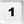). To hide the GUI press 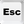.
If you perform no further action, ***EDE***-Gui will disappear automatically after a timeout (which can be configured). 

The GUI consists of two sections of buttons which do have different functionality:

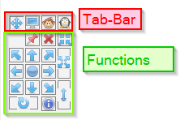

### Functions
The functions provide the actions you want to perform with ***EDE*** (for example: moving the currently active window to the lower left corner of the screen). Each TAB offers a different set of functions.

The functions panel is organized as the keys on the numerical keypad of your keyboard:

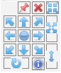  <-> 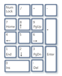

Each function can be accessed by pressing the corresponding key on the numerical keypad (if ***EDE*** is activated). If ***EDE*** is activated, functions can also be selected via mouseclick. Mouse-Hovering over the function-buttons on the ***EDE***-GUI will show a tooltip, offering short help. 

### TAB-Bar 
The Tab-Bar is used to switch between several sets of functions. ***EDE*** currently offers 4 TABS.

When ***EDE*** is activated, it opens on the given TAB: pressing  **Left-WIN** () followed by a number from 1 to 4 (as there are 4 TABS) on the numerical keypad will open/activate ***EDE*** on the given TAB. Subsequently pressing a key on the NUMPAD will call the chosen function and perform the associated action.

### Summary
So if you want to move the active window to  the lower left corner of the monitor, you have to activate ***EDE*** and press the corresponding NUMPAD key to perform this action.

The key-sequence to perform the action above looks like  +  -  (the meaning of + and - chars are described below in chapter *Conventions*)

To hide the GUI press .

## Conventions

Within this documentation, the following convention/symbols are used:

-   is meant to be LEFT-WIN key 
- , , 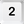, 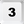, 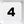, 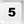, 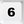, 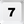, 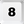, 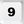, 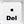, , , , , 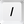 are meant to be the corressponding keys on the numerical keyboard
- Within key-sequences plus (+) and minus (-) chars are used to indicate different actions on the keys. Whilst **+** (plus) means to keep to previous key(s) pressed when pressing the next key, **-** (minus) means that the previously pressed key(s) have to be released before pressing the next key. For example the key-sequence  +  -  should be read as: press **LEFT-WIN** and then **NUMPAD-1** without relasing **LEFT-WIN** (+ char), release these keys (- char) before pressing the (second) **NUMPAD-1**
